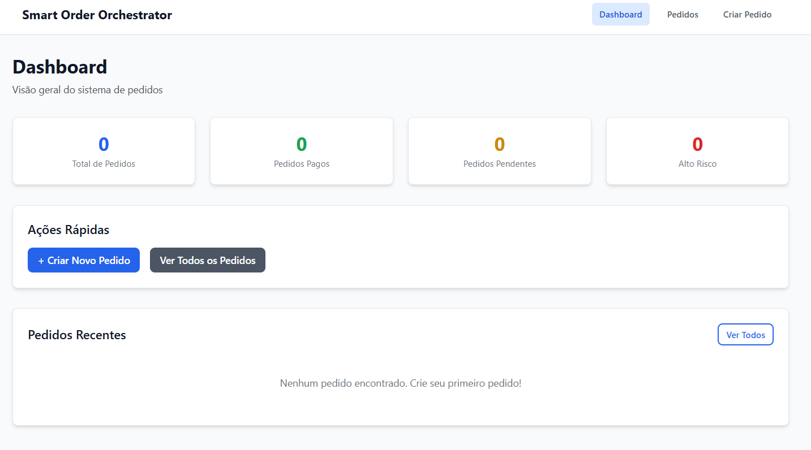

# Smart Order Orchestrator - Frontend

Frontend do Smart Order Orchestrator construído com React + Vite + TypeScript.

## 🎨 Interface do Produto

### Dashboard - Visão Geral



**Características da Interface:**
- ✅ **Design Moderno e Limpo** - Interface intuitiva com TailwindCSS
- ✅ **Dashboard Informativo** - Métricas em tempo real (Total de Pedidos, Pagos, Pendentes, Alto Risco)
- ✅ **Navegação Intuitiva** - Menu superior com acesso rápido (Dashboard, Pedidos, Criar Pedido)
- ✅ **Ações Rápidas** - Botões destacados para criar pedido e visualizar todos
- ✅ **Responsivo** - Interface adaptável para diferentes tamanhos de tela

**Funcionalidades Visíveis:**
- 📊 Cards de métricas com cores diferenciadas (azul, verde, laranja, vermelho)
- 🚀 Ações rápidas para criar e visualizar pedidos
- 📋 Seção de pedidos recentes com estado vazio informativo
- 🎯 Navegação clara e acessível

## 📚 Integração com Backend

O frontend consome APIs REST do backend Spring Boot. Veja [backend/README.md](../backend/README.md) para detalhes da API.

## 🚀 Stack Tecnológica

- **React 18+**: Biblioteca UI moderna e performática
- **Vite**: Build tool rápido com HMR (Hot Module Replacement)
- **TypeScript**: Type safety e melhor DX (Developer Experience)
- **TailwindCSS**: Utility-first CSS framework
- **Zustand**: State management leve e simples
- **Axios**: Cliente HTTP para comunicação com API REST
- **React Hook Form + Zod**: Validação de formulários type-safe
- **React Router DOM**: Roteamento client-side

## 📦 Instalação

```bash
# Instalar dependências
npm install

# Ou com yarn
yarn install

# Ou com pnpm
pnpm install
```

## 🛠️ Scripts Disponíveis

```bash
# Desenvolvimento (servidor local na porta 5173)
npm run dev

# Build para produção
npm run build

# Preview do build de produção
npm run preview

# Linting
npm run lint

# Linting com auto-fix
npm run lint:fix

# Formatação de código (Prettier)
npm run format
```

## 🌐 Configuração

### Variáveis de Ambiente

Crie um arquivo `.env` na raiz do frontend (baseado em `.env.example`):

```env
# API Base URL
# Em desenvolvimento, usa proxy do Vite (/api → http://localhost:8080)
# Em produção, use a URL completa do backend
VITE_API_BASE_URL=http://localhost:8080/api/v1

# Environment
VITE_ENV=development
```

### Proxy para API

O Vite está configurado para fazer proxy de `/api/*` para `http://localhost:8080/*`.

**Exemplo:**
- Frontend: `http://localhost:5173/api/v1/orders`
- Backend: `http://localhost:8080/api/v1/orders`

## 📁 Estrutura de Pastas

```
frontend/
├── src/
│   ├── components/     # Componentes reutilizáveis
│   │   ├── ui/         # Componentes base (Button, Input, Card, etc)
│   │   └── OrderCard.tsx
│   ├── pages/          # Páginas/rotas
│   │   ├── DashboardPage.tsx
│   │   ├── OrdersListPage.tsx
│   │   ├── CreateOrderPage.tsx
│   │   └── OrderDetailPage.tsx
│   ├── hooks/          # Custom hooks (futuro)
│   ├── store/          # Zustand stores
│   │   └── orderStore.ts
│   ├── services/       # Serviços de API
│   │   └── orderService.ts
│   ├── types/          # TypeScript types
│   │   └── index.ts
│   ├── utils/          # Funções utilitárias
│   │   └── index.ts
│   ├── lib/            # Configurações de bibliotecas
│   │   └── axios.ts
│   ├── App.tsx         # Componente principal
│   ├── main.tsx        # Ponto de entrada
│   └── index.css       # Estilos globais (TailwindCSS)
├── public/             # Arquivos estáticos
└── dist/              # Build de produção
```

## 🔗 Integração com Backend

O frontend consome APIs REST do backend Spring Boot:

- **Base URL**: `http://localhost:8081/api/v1` (desenvolvimento - porta atualizada)
- **Formato**: JSON
- **Endpoints**:
  - `POST /api/v1/orders` - Criar pedido
  - `GET /api/v1/orders` - Listar pedidos
  - `GET /api/v1/orders/{id}` - Buscar pedido por ID
  - `GET /api/v1/orders/number/{orderNumber}` - Buscar pedido por número
  - `POST /api/v1/payments/orders/{orderId}/refresh-status` - Atualizar status de pagamento (com botão na UI) 🔄

## 🎨 Componentes Disponíveis

### UI Components
- `Button` - Botão com variantes e estados
- `Input` - Input com label e validação
- `Card` - Card com header/footer opcionais
- `LoadingSpinner` - Indicador de carregamento
- `Alert` - Mensagens de sucesso/erro/aviso

### Business Components
- `OrderCard` - Card para exibir pedido
- `Layout` - Layout principal com navegação

## 📄 Páginas

- **Dashboard** (`/`) - Visão geral com estatísticas
- **Lista de Pedidos** (`/orders`) - Lista todos os pedidos
- **Criar Pedido** (`/orders/create`) - Formulário para criar pedido
- **Detalhes do Pedido** (`/orders/:id`) - Detalhes completos de um pedido
  - Botão "🔄 Atualizar Status Pagamento" (visível quando pedido tem `paymentId`)

## 🧪 Como Testar

### 1. Iniciar Backend

```bash
cd backend
mvn spring-boot:run
```

### 2. Iniciar Frontend

```bash
cd frontend
npm run dev
```

### 3. Acessar

- **Frontend**: http://localhost:5173
- **Backend API**: http://localhost:8081/api/v1/orders (porta atualizada)
- **Swagger UI**: http://localhost:8081/swagger-ui/index.html

## 🚀 Build para Produção

```bash
# Build
npm run build

# Preview do build
npm run preview
```

O build será gerado na pasta `dist/` e pode ser servido por qualquer servidor estático ou Cloud Storage.

## 🧪 Testes

### Estratégia de Testes

O frontend segue a estratégia de testes:

- **Testes Unitários:** Componentes isolados
- **Testes de Integração:** Páginas completas
- **Testes E2E:** Jornadas do usuário

### Como Executar Testes

```bash
# Testes unitários e de integração
npm run test

# Testes em modo watch
npm run test:watch

# Testes com cobertura
npm run test:coverage

# Testes E2E (quando configurado)
npm run test:e2e
```

## 📝 Próximos Passos (Futuro)

1. Implementar testes unitários e de integração
2. Configurar testes E2E (Playwright)
3. Adicionar autenticação/autorização
4. Implementar filtros e busca na lista de pedidos
5. Adicionar paginação
6. Implementar notificações em tempo real
7. Adicionar gráficos e métricas no dashboard

## 🔄 Funcionalidades Recentes

### Atualização de Status de Pagamento (Dez 2024)

✅ **Implementado:** Botão na página de detalhes do pedido para atualizar manualmente o status do pagamento.

**Como funciona:**
- Botão aparece apenas quando o pedido tem `paymentId`
- Consulta o gateway externo (AbacatePay) e atualiza o status no banco
- Atualiza automaticamente a UI com o novo status
- Tratamento de erros com mensagens informativas

**Arquivos:**
- `src/services/orderService.ts` - Método `refreshPaymentStatus()`
- `src/store/orderStore.ts` - Action `refreshPaymentStatus()`
- `src/pages/OrderDetailPage.tsx` - Botão e lógica de atualização
